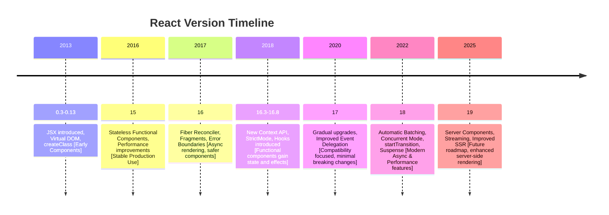

# React Version Timeline and Feature Comparison

## Overview

React, released by Facebook in 2013, has evolved significantly over time. Below is a timeline showing major versions, key features, and notable improvements. This focuses on functional component patterns, hooks, and ecosystem changes relevant to production development.

---

---

## React Version Timeline

### **React 0.3 – 0.13 (2013–2015)**

- **Highlights**

  - Initial public release and early adoption
  - JSX introduction for HTML-like syntax in JavaScript
  - Virtual DOM concept
  - Component-based architecture

- **Improvements**

  - Gradual API stabilization
  - `React.createClass` pattern
  - Support for event handling and state management

- **Notes**

  - Early adopters had to deal with frequent breaking changes.

---

### **React 15 (2016)**

- **Key Features**

  - Improved rendering performance
  - Reduced memory usage
  - Support for `stateless functional components`

- **Important Changes**

  - Removal of support for React DOM’s custom attribute `class` (moved to `className`)

- **Why It Matters**

  - First widely adopted stable version for production apps

---

### **React 16 (2017) – Fiber Reconciler**

- **Key Features**

  - Complete rewrite of the core architecture (React Fiber)
  - Better handling of asynchronous rendering
  - Fragments and error boundaries introduced
  - Return arrays and strings from components

- **Improvements**

  - Performance boost for large-scale apps
  - Error boundaries prevent entire app crashes

- **Notes**

  - Marked a huge improvement in render scheduling and maintainability

---

### **React 16.3 – 16.8 (2018)**

- **Key Features**

  - New context API (`React.createContext`) – replacing legacy context
  - Introduction of `React.StrictMode`
  - **React Hooks** introduced in **16.8**

    - `useState`, `useEffect`, `useReducer`, `useContext`, etc.

- **Why Hooks Matter**

  - Allowed functional components to manage state and side effects
  - Reduced reliance on class components

- **Notes**

  - Version 16.8 is considered a turning point in modern React development

---

### **React 17 (2020)**

- **Key Features**

  - No new developer-facing features; focused on **gradual upgrades**
  - Improved event delegation and compatibility with older React versions

- **Why It Matters**

  - Simplifies upgrading large applications
  - Minimal breaking changes

---

### **React 18 (2022) – Concurrent Rendering**

- **Key Features**

  - Automatic batching of updates
  - `useId` hook for generating stable IDs
  - Concurrent Mode (`createRoot`) for improved performance
  - Transitions (`startTransition`) for non-urgent updates
  - Suspense for data fetching

- **Improvements**

  - Better support for modern asynchronous UI
  - Optimized rendering and reduced blocking

- **Notes**

  - React 18 is the recommended modern version for new projects

---

### **React 19 (2025, future roadmap)**

- **Expected Features**

  - Enhanced server components
  - Improved streaming and suspense support
  - Smaller bundle sizes and enhanced performance

- **Notes**

  - Still in alpha/stable candidate stages; main focus is on server-side rendering improvements and concurrent workflows.

---

## **Most Extended Version of React**

### **React 16 / 16.8–16.14**

- **Why Extended**

  - Introduced hooks, error boundaries, fragments, and context API
  - Considered the foundation of modern React
  - Widely adopted in enterprise apps

- **Impact**

  - Shifted React development from class-heavy codebases to functional components
  - Enabled better component reuse and simpler state management

---

## **Summary of Version Trends**

| Version  | Key Features                       | Focus Area           | Notes                     |
| -------- | ---------------------------------- | -------------------- | ------------------------- |
| 0.3–0.13 | JSX, Virtual DOM, Components       | Core Architecture    | Early experimentation     |
| 15       | Functional components              | Performance          | Widely used in production |
| 16       | Fiber, Fragments, Error Boundaries | Render Scheduling    | Major rewrite             |
| 16.8     | Hooks, Context API                 | State & Side Effects | Modern React foundation   |
| 17       | Gradual upgrades                   | Compatibility        | Minimal breaking changes  |
| 18       | Concurrent rendering, Suspense     | Async & Performance  | Recommended for new apps  |
| 19       | Server components, streaming       | SSR & performance    | Future roadmap            |

---
